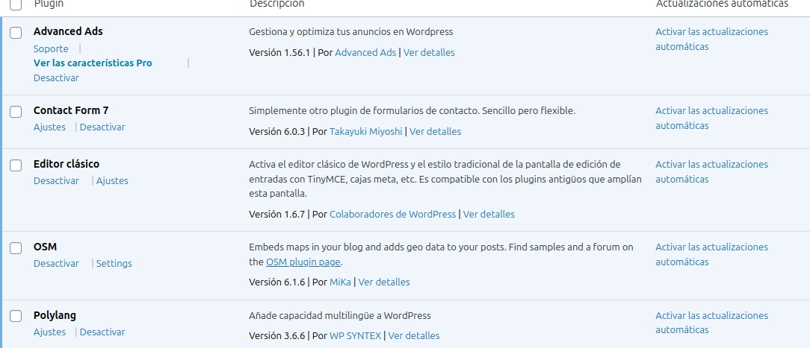

# WordPress

Desde diciembre, he empezado un proyecto en WordPress, donde he podido hacer muchas opciones gracias a WordPress, sinceramente, el proyecto me ha gustado mucho, sobre todo porque lo he hecho del tema que más me gusta, la Fórmula 1, a continuación os explicaré todo lo que he hecho junto a WordPress.

## Página Principal
Creo que la mejor manera de arrancar este repositorio, es hablando sobre la página principal, en esta página podemos encontrar toda la información creada por mí, tanto las páginas, los posts como las categorías.
Esta página la he decidido llamar como PitStop F1.

Más abajo, encontramos la categoría en donde subo mis publicaciones, en este apartado encontramos las 9 últimas entradas de mi página web, en las publicaciones he subido un poco de todo, hay desde noticias sobre equipos en concreto y sobre la Fórmula 1 en general.

Más abajo encontramos todas las categorías de mi página, en donde si clicas en una categoría, te lleva a todos los posts relacionados con esa categoría.

Por ejemplo vamos a entrar en los posts de la categoría Aston Martin.

Como vemos, nos encontramos con dos posts en donde se explica un poco sobre sus cambios para poder luchar por grandes cosas a futuro.

## Páginas en mi página principal
De nuevo al inicio de mi página, arriba a la derecha tenemos otras cosas sobre nuestra página, por ejemplo, sobre nosotros, nuestra política de privacidad, nuestra ubicación, nuestro formulario de contacto y nuestras dos categorías más importantes que son la de Curiosidades y la de Noticias.
Dentro de esta categoría he puesto como subcategorías a todos los equipos de la parrilla y una categoría llamada general en donde hablo de cosas relacionadas con todos los equipos o solo a la propia F1 sin incluir a los equipos.

Además, gracias al plugin Polylang, he podido hacer que todas mis páginas y publicaciones se puedan ver en inglés.

Como veis, todo está completamente traducido al inglés, incluso las páginas en donde explicamos cosas sobre nosotros, por ejemplo, nuestra ubicación.

## Posts 
He creado un total de 30 posts, como antes expliqué, tenía toda mi página traducida al inglés, por ende, he creado los posts tanto en español como en inglés, 15 de cada idioma.

Además de esto, uno de estos posts está programado para una fecha estimada, en este caso, una de las noticias de Aston Martin, que está programada para el 14 de febrero.

Finalmente, uno de mis posts, en este caso, en el que digo Curiosidades sobre Lewis Hamilton, he puesto modificadores HTML, en este caso he puesto <b>, antes de los títulos y </b> después de estos, para que estos se vean en negrita en la página.

## Categorías
He creado un total de 2 categorías con 12 subcategorías, estas están tanto en español como en inglés.
Estas categorías eran Curiosidades y noticias y las subcategorías son todos los equipos de Fórmula 1, incluyendo al equipo Cadillac, que se incorporará en 2026, y la categoría General.

## Páginas
He hecho un total de 4 páginas en cada idioma, 8 en total, incluido un formulario de contacto, gracias al plugin Contact Form 7, además de poner una ubicación con el plugin OSM, en la página Nuestra Ubicación.

## Anuncios 
He podido crear un anuncio que lo he puesto al acabar el post, gracias al plugin Advanced Ads, en este caso, he puesto un anuncio para conseguir entradas para el GP de España en el Circuito de Barcelona-Cataluña.
Además, si clicas el enlace que te sale en el anuncio, llegarás a la página oficial del circuito para comprar entradas.

## Apariencia
El tema que he utilizado para mi página principal ha sido el tema Book Shop.

## Menús 
En el apartado de Apariencia, más específicamente, en Menús, he creado dos menús para mi página principal, uno en inglés y uno en español.

## Plugins
En total tengo 5 plugins, que me han ayudado a la hora de hacer mi trabajo, en este apartado comentaré para que me ha servido cada uno.
Classic Editor me ha ayudado mucho a la hora de crear mis posts, con este editor me ha sido mucho más fácil editar mis publicaciones
OSM me ha ayudado a poner la ubicación de la empresa correctamente.
Polylang me ha ayudado a poner la página en varios idiomas.
Contact Form 7 me ha ayudado a poder crear un formulario de contacto en mi página web.
Advanced Ads me ha ayudado a poder crear anuncios dentro de mi página web.

## Usuarios
Finalmente, hablaré sobre los usuarios que he creado en mi página, a cada usuario le he asignado un rol distinto.
He creado estos usuarios:
Carlos Sainz, que es Autor
David Perogil, que es Editor
Fernando Marulo, que es Suscriptor
Manolo Gonzalez, que es Colaborador

Carlos Sainz puede crear posts y añadir nuevas fotos.

David Perogil tiene más funciones, aparte de las mencionadas anteriormente, puede crear categorías y etiquetas, puede ver y crear páginas y puede crear un formulario de contacto.

Fernando Marulo solo puede editar su perfil y ver el blog.

Manolo Gonzalez puede crear posts, pero este no puede añadir nuevos medios.

